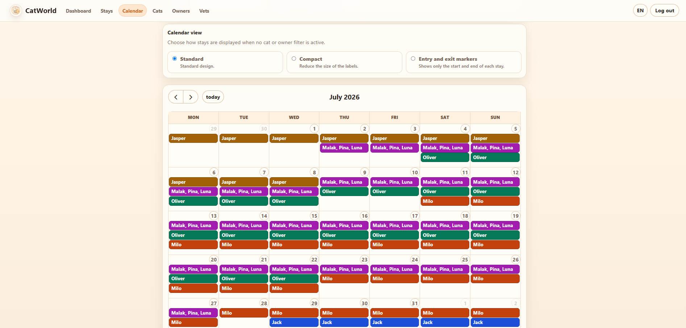
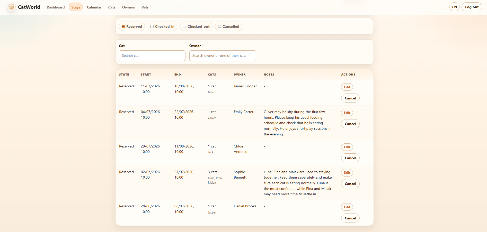
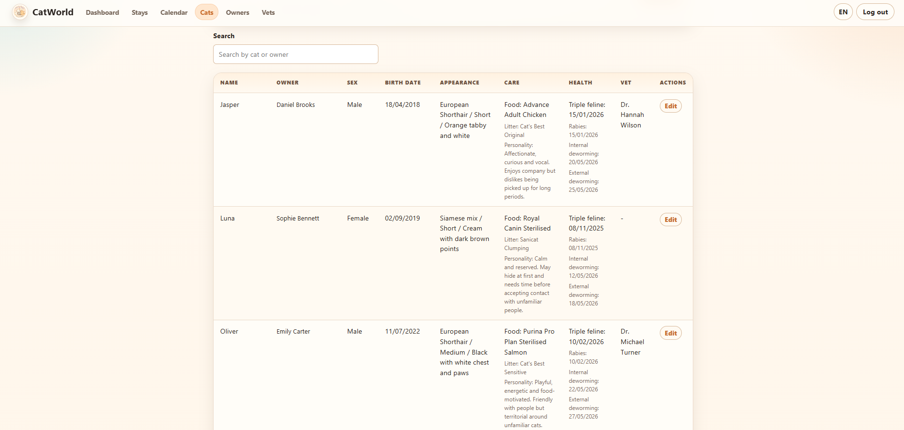

# CatWorld


CatWorld is a full-stack application for managing a small cat boarding business. It covers customer and cat records, reference vets, stay bookings and calendar-based planning.

## Screenshots

### Stay calendar



### Stay management



### Cat management



## Features

* Owner, cat and reference vet management.
* Creation, editing and cancellation of stays.
* Multi-cat stays for cats belonging to the same owner.
* Validation against overlapping active stays.
* Dynamic reserved, checked-in, checked-out and cancelled statuses.
* Filtering by status, cat and owner.
* Monthly calendar with standard, compact and entry/exit display modes.
* Basic login and English/Spanish interface.
* Docker Compose setup with MySQL, Spring Boot, Angular and Nginx.
* Flyway-managed database migrations.
* Documented manual backup and restore flow.

## Stack

**Backend:** Java 17, Spring Boot, Spring Security, Spring Data JPA, MySQL and Flyway.

**Frontend:** Angular, TypeScript, SCSS and FullCalendar.

**Testing and infrastructure:** JUnit 5, Mockito, Vitest, Docker Compose, Nginx and GitHub Actions.

## Quick Start

Requirements:

* Docker Desktop or Docker Engine with Docker Compose

Copy `.env.example` to `.env`, then run:

```bash
docker compose up --build
```

Open:

```text
http://localhost:4200
```

Use the login credentials configured in `.env`.

Private deployment, environment and backup instructions are documented in [`docs/OPERATIONS.md`](docs/OPERATIONS.md).

## Demo Flow

A basic workflow can be tested in a few minutes:

1. Log in.
2. Create an owner and one or more cats.
3. Optionally assign a reference vet.
4. Create a stay and inspect it in the stays list and monthly calendar.
5. Edit or cancel the stay.

## Validation

Backend:

```bash
./mvnw verify
```

Frontend:

```bash
cd frontend
npm run format:check
npm run build
npm run test:ci
```

## Architecture

CatWorld uses a layered Spring Boot monolith:

```text
controller -> service -> repository -> database
```

DTOs and mappers keep HTTP contracts separate from persistence entities.

The production-oriented request flow is:

```text
Browser -> Nginx (Angular static files and /api proxy) -> Spring Boot API -> MySQL
```

Flyway manages the database schema. Stay status is calculated dynamically from its dates and cancellation timestamp rather than persisted.

More detail is available in:

* [`docs/ARCHITECTURE.md`](docs/ARCHITECTURE.md)
* [`docs/uml`](docs/uml)
* [`frontend/README.md`](frontend/README.md)

## Current Scope

* One configured application user; no role-based permissions.
* No room capacity, billing, payment or inventory management.
* Designed for private/local deployment with manual backups.
